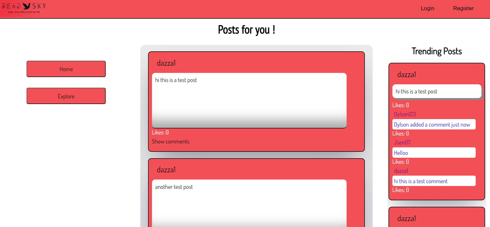

# Welcome to readSky.

Readsky is a modern, web-based platform for sharing and connecting with people around the world. Our platform provides users with the ability to post their thoughts and feelings, as well as follow, like, and comment on posts from others.

# Getting Started

To get started, simply sign up/register for an account!
Once you've created your account, you can begin posting and interacting with other users. You can also use the search bar to find people, topics, or hashtags you're interested in.
## Prerequisites
We use Node.js,npm,sequelize,Express,express-session, Handlebars.js, DotEnv, MySQL2 and Passport Express to provide a secure and user friendly experience.

## Features

ReadSky offers a range of features to make your experience even better:
- Post and share your thoughts and feelings
- Follow, like, and comment on posts from others
- Search for people, topics, or hashtags
- Login and logout securely
- Delete comments
- And more!

## Support

If you have any questions or need help using readSky, please don't hesitate to contact us. We would be more than happy to assist you.

Thanks for choosing readSky! We hope you have a great time connecting with the world.

# FUTURE DEVELOPMENTS, we plan to add the following features:
- Private messaging
- Event creation and calendar integration
- Customizable profile pages
- Video and image sharing
- Geolocation tagging
- Trending topics, posts, and hashtags
- And much more!
# MONETIZATION PLAN:
We could implement a subscription-based model, where users pay for access to premium features and content. We could also add banner ads and sponsored posts. Additionally, we could offer a marketplace for users to buy and sell items. Finally, we could allow users to make donations to support the platform.

# Installing
1. Clone the repository

   ```bash
   git clone https://github.com/ReadSky
   ```

2. Install dependencies

   ```bash
   npm install
   ```

3. Start the server

   ```bash
   node server.js
   ```

4. Visit http://localhost:3001 in your browser to view the app.

## Built With

- [Node.js](https://nodejs.org/en/) - JavaScript runtime environment.

## Deployment

* readSky is deployed live on heroku [here](https://readsky.herokuapp.com/)
* the source code for the project can be found on Github [here](https://github.com/jsen07/readSky)
* The deployed project will look similar to the below screenshot


## Credits

This project was built by [Jayssen De Castro](https://github.com/jsen07), [Harun Saini](https://github.com/193G), [Nkem Okoro](https://github.com/dakenny5241) and [Daryl Blough](https://github.com/darylbg)